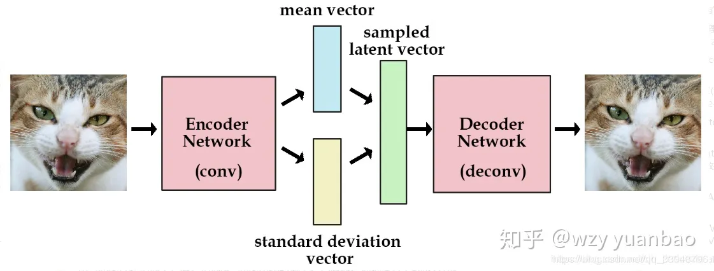
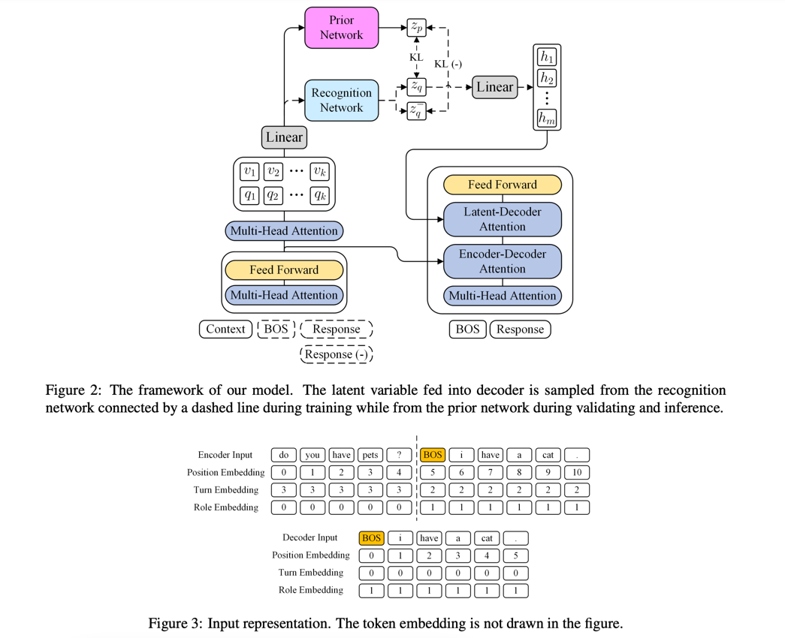
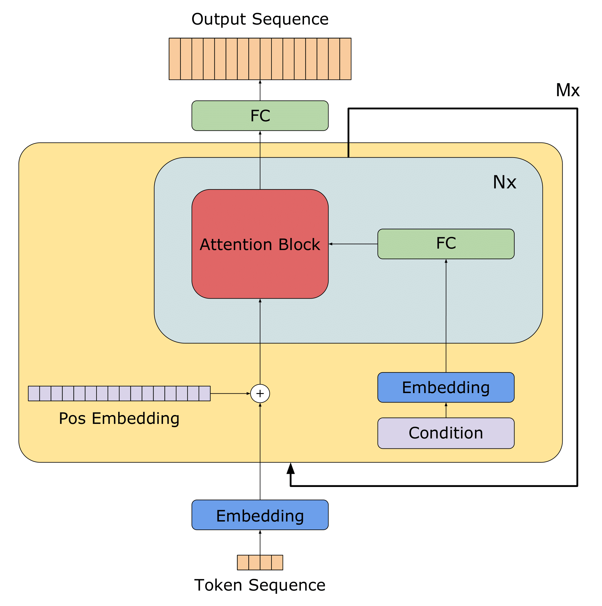
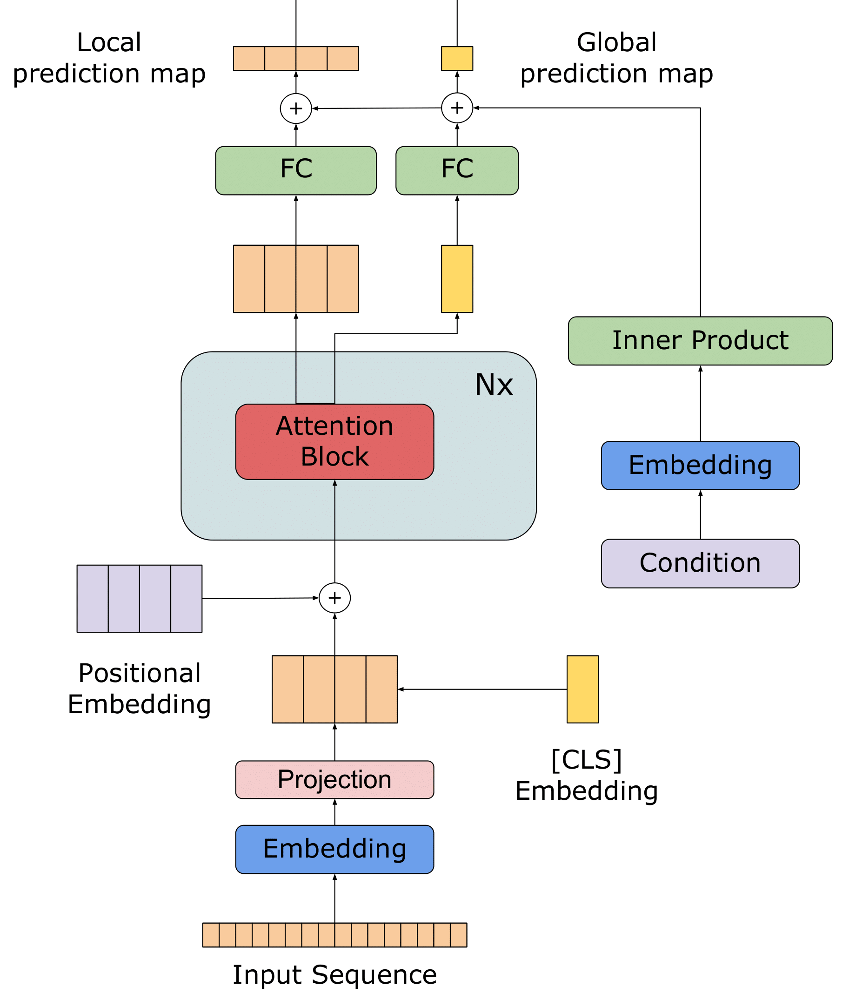
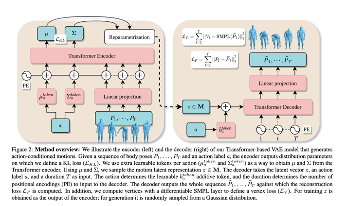
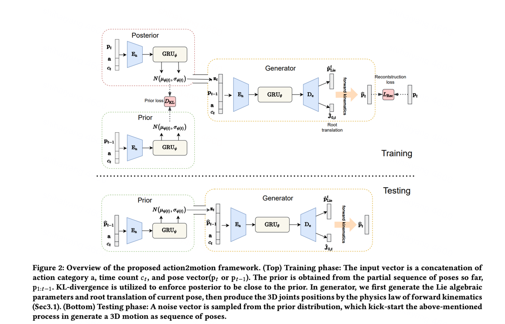

## 基于情绪生成钢琴乐

有几个需要做的

1. 选择带有情绪的MIDI数据集   ✅
2. 预处理MIDI数据集    ✅  co-representation中已经处理好了
3. 训练模型
   1. 先用**Transformer**能复现出来；  **embedding**  **encoder**  **decoder**  attention   ✅
   2. 加入CVAE模型   encoder decoder reparameterization  kl_loss
   3. 加入情绪  用情绪标签来训练模型
4. 生成音乐   旋律文件转MIDI  或者直接生成MIDI ✅
   1. 加入情绪  胶囊？  把一段脑电识别后，保存情绪胶囊，然后生成音乐的时候，加入情绪胶囊 （常规的操作是根据情绪条件，效价唤醒的正负来影响音乐，我们认为这样选择太少，我们基于情绪胶囊来选择音乐，原生带有概率，信息更加丰富）
   2. 
5. 保存转wav  ✅这个已经知道如何做

开搞。

### 选择数据集

目前根据读到的，目前观察有情绪的钢琴数据集。

Dataset: [EMOPIA: A Multi-Modal Pop Piano Dataset For Emotion Recognition and Emotion-based Music Generation](https://arxiv.org/abs/2108.01374)
[Code](https://github.com/annahung31/EMOPIA?tab=readme-ov-file)
[Demo](https://annahung31.github.io/EMOPIA/)

用于情感识别和基于情感的音乐生成的多模态流行钢琴数据集

1700个带情绪标签的音乐片段，情绪标签是按罗素四象限来的。Q1-Q4都有。

### 预处理数据集

`EMOPIA`的预处理代码

参考其他的论文中的代码：

```python
# midi2couper
```

术语：
velocity: 速率
pitch: 音高
duration: 持续时间
note: 音符
track: 轨道
pedal: 踏板
chord: 和弦
tempo: 速度
rest: 休止

### 训练网络

跑了一个LSTM生成的简单模型，大概思路就是通过把节奏数据集切分成一段一段的旋律，然后每一段旋律作为input,下一个音符作为target，
输入到LSTM中训练模型。

训练完成的模型，再根据步数n，预测出n步的旋律音符。根据预测出的n步旋律再生成MIDI文件。就完成了音乐生成。

此时有几个疑问，如何加入情绪？如何让生成的音乐更加有情感？

我觉得首先得跑通一个transformer的模型，复现一下，然后再考虑加入情绪。
最好是基于MIDI的，看transformer下，下一个音符生成的逻辑是什么。

这里可以参考的是：
YouTube上的一个UP，The Sound of AI公司创始人的分享。
包括LSTM生成音乐的实现也是他的分享。
[Code:基于Transformer生成旋律](https://github.com/musikalkemist/generativemusicaicourse)

最小MVP版本
先用四象限的方式生成音乐。先实现，再考虑优化。

实现方式：
用带情绪的MIDI数据集，训练一个transformer模型。直接训练一个模型出来。

```python
# Emotion:(1-4) 4象限
# Melody: 旋律  
# Tokenizer之后，输入到transformer模型中，输出下一个音符。

# 多大模型？
这样就简单了，现在最重要先把带情绪的旋律模型训练出来。能够根据情绪象限生成旋律。不用考虑情绪胶囊先。
```

文本怎么做情感分析的？音符能否借鉴一下对应的方式 构建Transformer模型。
加条件，VV在Transformer结尾提到了可以探索的地方，就是在生成时在metadata中加入Condition
Condition melody generation on metadata: 用metadata来生成旋律。
在编码器中传递。
元编码器，文本、或者艺术风格、或者情感。
在解码器中调节生成的音乐。

一个思路[在Transformer的Input加入Metadata](https://www.tdcommons.org/cgi/viewcontent.cgi?article=7612&context=dpubs_series)

1. adding a metadata embedding layer  元数据嵌入层
2. conditioning self-attention on the metadat
3. conditioning with gated self-attention 用门控的自我关注进行调节
4. employing a different encoder-decoder architecture 使用不同的编码器-解码器架构

```
Input sequence: [token1, token2, ..., tokenN]
Metadata: [metadata1, metadata2, ..., metadataM]
Self-attention mechanism: [query, key, value]
Output sequence: [output1, output2, ..., outputN]

Condition the self-attention mechanism on the metadata
Inputs: Query Q, Keys K, Values V, Metadata M
Outputs: Context vector C

Compute the self-attention scores: S = QKT
Compute the metadata-aware attention weights: A = MTS
Compute the context vector: C = V*A
    Where:  Q: Query vector
            K: Key vector
            V: Value vector
            M: Metadata vector
            S: Self-attention scores
            A: Metadata-aware attention weights
            C: Context vector
```

一个思路:[MECT: Multi-Metadata Embedding based Cross-Transformer 中文名字识别中加入多个Metadata Embedding](https://aclanthology.org/2021.acl-long.121.pdf)  [代码Code](https://github.com/CoderMusou/MECT4CNER)

2021年  MECT:Multi-metadata Embedding based Cross-Transformer

为了更好地整合汉字组件的信息，我们使用汉字结构作为另一种元数据，并设计了一种双流形式的多元数据嵌入网络。所建议的网络架构如图2a所示。该方法基于Transformer的编码器结构和FLAT方法，整合了汉语单词的意义和边界信息。所提出的双流模型使用类似于自注意力结构的Cross-Transformer模块来融合汉字组件的信息。在我们的方法中，我们还使用了广泛用于视觉语言任务的多模态协作注意力方法（Lu et al.， 2019）。不同之处在于，我们添加了一个随机初始化的注意力矩阵来计算两种类型的元数据嵌入的注意力偏差。


word2vec
emoChord2vec

tokenizer

train

generate

Multi-Metadata Embedding based Cross-Transformer

MECTGan

### Paper [Transformer-based Conditional Variational Autoencoder for Controllable Story Generation](https://arxiv.org/abs/2101.00828)

有VAE的论文介绍，参考

### Paper: [Autoregressive Image Generation using Residual Quantization (CVPR 2022)](https://github.com/kakaobrain/rq-vae-transformer)

### Paper:[TVAE](https://www.ijcai.org/proceedings/2019/0727.pdf)

结构一样，可以借鉴一写描述语句

### Paper: [对话生成TVAE Dialogue Generation](https://arxiv.org/abs/2210.12326)

2022年



### Paper:[Generating music with sentiment using Transformer-GANs](https://ar5iv.labs.arxiv.org/html/2212.11134?_immersive_translate_auto_translate=1)

[Code](https://github.com/amazon-science/transformer-gan/blob/main/model/transformer_gan.py)




### Paper: [Action-Conditioned 3D Human Motion Synthesis with Transformer VAE](https://arxiv.org/pdf/2104.05670.pdf)

[Code](https://github.com/Mathux/ACTOR/tree/master)

ICCV 2021

Transformer VAE  Conditioned



参考一下图片
我们举例说明了基于transformer的VAE模型的编码器(左)和解码器(右)，该模型生成动作条件运动。
给定了一个身体动作序列 $P_1...P_t$ 和动作标签action $a$. encoder层输出用来定义KL散度的分布式参数 均值$\mu$ 和 方差$\sigma$ .
我们使用每个动作额外的可学习令牌$(µ^{token}_a和Σ^{token}_a)$作为从Transformer编码器获得µ和Σ的一种方式, 使用$(µ^{token}_a和Σ^{token}_a)$可以采样出一个动作的隐变量标识 $z \in M$ .

decoder把隐向量$z$,action标签$a$和一个持续时间 $T$作为input, 动作参数$a$决定了一个可学习的参数$b^{token}_a$,持续时间决定了添加的PE个数。decoder 输出一个完成的预测序列 $\hat{P}_1,..\hat{P}_t$,并且根据预测序列 $\hat{P}$ 计算Reconstruction Loss。
计算了一个SMPL层来定义顶点Loss(Vertex loss).

最后隐向量$z$，在训练时候是从encoder输出中获取，在生成时，是随机从高斯分布采样的。这应该也是用重参数化技术   reparmetrization trick.

**实现方式：**
**Encoder：** 编码器以任意长度的姿势序列和动作标签a作为输入，输出运动潜在空间的分布参数µ和Σ，使用Reparametrization trick技术采样了一个$z \in M$且 $M ⊂ R^d$, (所有的输入姿态参数(R)和平移(D)首先被线性嵌入到R空间中). 嵌入了一个任意长度的序列到隐空间，需要集成时间维度。在别的领域，引入了class类型的令牌，为了池化的目的。最后引入了每个action的两个可学习的参数$µ^{token}_a and Σ^{token}_a$,称之为 分布式参数token； 然后追加了Embedd Pose Seq到这个tokens，由此产生的encoder input是与正弦函数形式的position encoding的总和。获取encoder的前两个输出作为分布式参数令牌，其他的丢弃。

**Decoder**：给一个single latent vector z 和一个action，生成一个运动序列。一次性，不是自回归的。
我们使用Transformer解码器模型，其中我们将时间信息作为查询(以T正弦位置编码的形式)，并将潜在向量与动作信息相结合，作为键和值。

为了整合动作信息，我们只需添加一个可学习偏差b，将潜在表征转移到动作依赖空间。

encoder 输出R中的T向量序列，从中我们通过线性投影得到最终位姿Pb1，…。， PbT

在给定姿态参数作为解码器输出的情况下，使用可微的SMPL层来获取顶点和关节。

**训练Training**

**Reconstruction Loss**  $\mathcal L_P$ 使用pose的L2 loss，真实$P_1...P_t$与预测$\hat{P}_1...\hat{P}_t$   ,则
$\mathcal L_P = \sum_{t=1}^T||P_t - \hat{P}_t||^2_2$

**KL loss** ： 最小化encoder 分布与目标分布的KL 散度

### Paper: [Action2Motion: Conditioned Generation of 3D Human Motions](https://arxiv.org/pdf/2007.15240.pdf)

[Coder 代码](https://github.com/EricGuo5513/action-to-motion/tree/master)

参考另一个图片，思路：分为先验网络、后验网络、生成网络。
**在训练阶段：**

先验网络中输入向量input vector是concat拼接下（action类型 $a$，时间计数$c_t$，动作向量$p_t$ or $p_{t-1}$）,先验概率是目前为止的部分姿态获得($p_{1:t-1}$),通过KL散度强制后验概率接近先验概率。

在生成器中，根据后验概率($p_t + a + c_t$)生成的高斯分布，采样$z$，然后拼接在input vector上，再生成器中encoder/decoder之后，跟目标 $p_t$ 计算reconstruction loss。最后应该是min(KL loss + Reconstruction loss)

**在测试阶段：**
根据先验概率的高斯分布，通过重参数化技术(reparametrization trick)采样一个$z_t$，拼接在($z_t + P_{t_1} + a + c_t$ ) 经过encoder/decoder 生成预测  $P_t$

这个论文提到Conditional Temporal VAE，解释这个词：基于条件时态的变分自动编码器

给定一个真实的运动或姿态序列 $M = [p_1， p_t]$，VAE 旨在最大化从学习模型分布中采样 $M$ 的概率。在时间 $t$ 处，RNN 模块 $p_\theta(P_t|P_{1:t-1},z_{1:t})$ 预测具有潜在变量$z_{1:t}$的当前姿态$p_t$，并以先前的状态$p_{1:t−1}$为条件。
我们依靠变分神经网络$q_φ (z_t |p_{1:t})$来近似真实未知后验分布$p_θ (z_t |p{1:t})$。

### Paper： [相对位置嵌入的transformer](https://www.sciencedirect.com/science/article/pii/S0031320323006039)

2024年  新论文，在视频上应用了相对位置嵌入

音乐上Bar Note的关系，感觉可以加一个相对位置

