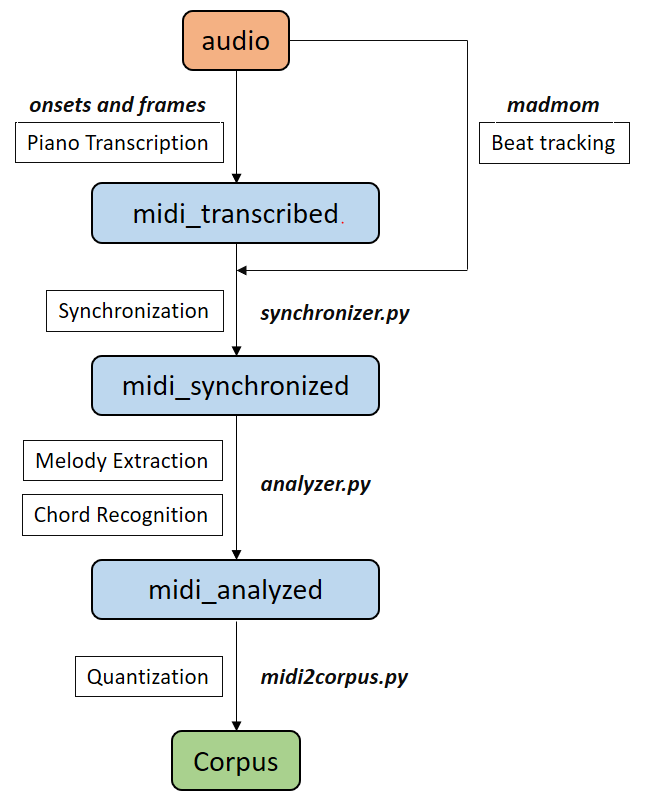

[EMOPIA](https://arxiv.org/abs/2108.01374)  论文提供了两个官方的代码
用来处理数据集的代码是 [EMOPIA / dataset]

co-representation的下载是emopia的dataset中第一步

[dataset 来源](https://github.com/annahung31/EMOPIA/tree/main/dataset)

这个数据集是用在Transformer中的处理后数据集

处理步骤是  [YatingMusic / compound-word-transformer](https://github.com/YatingMusic/compound-word-transformer/blob/main/dataset/Dataset.md)  中的1-3步

