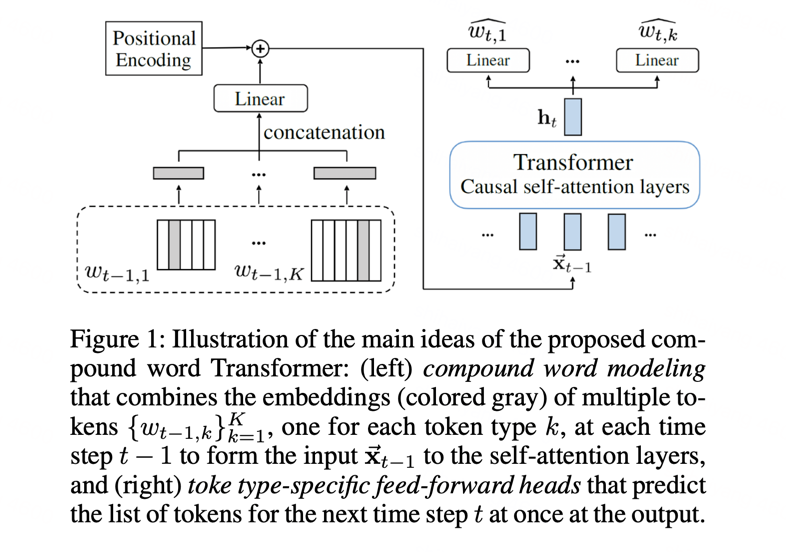

[EMOPIA](https://arxiv.org/abs/2108.01374)  论文提供了两个官方的代码
用来处理数据集的代码是 [EMOPIA / dataset]

[这是transformer架构的论文](https://arxiv.org/pdf/2101.02402.pdf)

co-representation的下载是emopia的dataset中第一步


[EMOPIA](https://arxiv.org/pdf/2108.01374.pdf)  介绍了数据集的格式。
这个论文中transformer使用的c类型 ：复合词（Compound Word）这一个数据集。
分了4个Type，每个type有不同的数据。

类midi和REMI都将事件视为单独的令牌。

在Compound Word中，属于同一类的令牌被分组到一个超级令牌中，并放置在相同的时间步上(参见图1(c))。

复合词默认考虑三个族:旋律(metrical)、音符(Note)和序列结束EOS(end-of-sequence)。

我们还考虑了“情感(Emotion)”标记，并将其创建为一个新家族，如图1(d)所示。

前置方法是由CTRL[44]驱动的，CTRL是自然语言处理(NLP)中最先进的可控文本生成模型，它使用全局令牌来影响序列的一些整体属性。

Type = Emotion； 新的，只有Emotion位 = 1，其他位 = 0
Type = Metrical,
Metrical = Bar； 只有Bar位 = 1，其他位 = 0
Metrical = Beat,Chord,Tempo； Beat,Chord,Tempo位是有值的，其他位没有
Type = Note； Node代表音符，音符需要有Pitch、Duration和Velocity，所以Pitch、Duration和Velocity位是有值的，其他位没有

所以一个正确的token应该是符合逻辑的。我生成的怎么都是没关系的一样。
输出一个前100个token看看。

数据集的结构。
每个seq都是一个语音的序列，src和tgt是对应的  tgt[i]=src[i+1]，所以tgt的长度比src短1
而batch_mask是指src中的padding位置。如果src[i]是真实数据，batch_mask[i] = 1，否则为0
```
 "type":{
      "EOS":0,
      "Emotion":1,  // 情绪
      "Metrical":2,  // 旋律
      "Note":3  // 音符
   },
  "bar-beat":{
      "0":0,
      "Bar":1,
      "Beat_0":2,
      "Beat_1":3,
      "Beat_10":4,
   "tempo":{
      "0":0,
      "CONTI":1,
      "Tempo_101":2,
   "chord":{
      "0":0,
      "A#_+":1,
   "pitch":{  // 音高
      "0":0,
      "Note_Pitch_100":1,
   "emotion":{
      "0":0,
      "1":1,                        
      
# 节奏    和弦   小节/节拍      类型    音高        持续时间     速度     情绪  
# tempo  chord  barbeat      type    pitch        duration  velocity  emotion      
# [56(+2), 127(+2), 18(+1),   4,    85(+1),    18(+1),    41(+1),   5(+1)]      
# [128,   256,     64,     32,   512,   128,      128,      128]

type=1 情绪
type=2,Metrical时，
     barbeat=1，代表是bar，chord,tempo 是0
     barbeat=0代表ignore， chord,tempo 是0 ignore
     其他barbeat代表真的beat，就会有对应的chord和tempo
     pitch,duration,velocity都是0 ignore
type=3,Note时，
     pitch,duration,velocity都有值，
     barbeat,chord,tempo都是0 ignore
```
```
     


batch_x[0][0:20]
tensor([[  0,   0,   0,   1,   0,   0,   0,   3],  # 情绪
        [  0,   0,   1,   2,   0,   0,   0,   0],  # bar
        [  8, 134,   2,   2,   0,   0,   0,   0],    # beat
        [ 29,  45,  12,   2,   0,   0,   0,   0],    # beat
        [  0,   0,   0,   3,  26,  11,  21,   0],      # note
        [  1,  45,  13,   2,   0,   0,   0,   0],    # beat
        [  0,   0,   0,   3,  33,  12,  15,   0],      # note
        [  1,  45,  14,   2,   0,   0,   0,   0],    # beat
        [  0,   0,   0,   3,  25,  12,  18,   0],      # note
        [  0,   0,   0,   3,  26,  16,  18,   0],      # note
        [  1,  45,  15,   2,   0,   0,   0,   0],    # beat
        [  0,   0,   0,   3,  38,  13,  16,   0],      # note
        [ 22,  61,  16,   2,   0,   0,   0,   0],    # beat 
        [  0,   0,   0,   3,  33,   3,  25,   0],      # note
        [  1,  45,   4,   2,   0,   0,   0,   0],    # beat
        [  0,   0,   0,   3,  33,   3,  17,   0],      # note
        [  1,  45,   5,   2,   0,   0,   0,   0],    # beat
        [  0,   0,   0,   3,  33,  14,  18,   0],      # note
        [  0,   0,   0,   3,  38,   3,  14,   0],      # note
        [  1,  60,   6,   2,   0,   0,   0,   0]]) # beat


batch_x[0][1014:1020]
tensor([[ 1, 45,  7,  2,  0,  0,  0,  0],
        [ 0,  0,  0,  3, 48, 11, 16,  0],
        [ 1, 45,  9,  2,  0,  0,  0,  0],
        [ 0,  0,  0,  3, 48, 10, 14,  0],
        [ 0,  0,  1,  2,  0,  0,  0,  0],
        [ 0,  0,  0,  0,  0,  0,  0,  0]])
batch_y[0][1014:1020]
tensor([[ 0,  0,  0,  3, 48, 11, 16,  0],
        [ 1, 45,  9,  2,  0,  0,  0,  0],
        [ 0,  0,  0,  3, 48, 10, 14,  0],
        [ 0,  0,  1,  2,  0,  0,  0,  0],
        [ 0,  0,  0,  0,  0,  0,  0,  0],
        [ 0,  0,  0,  0,  0,  0,  0,  0]])
batch_mask[0][1014:1020]
Out[87]: tensor([1., 1., 1., 1., 1., 0.])
```


====

解析论文

例如，为了表示乐谱，我们可能需要描述音符内容的符号(例如，音高和持续时间)，

它们在时间上的位置，演奏每个音符的乐器，以及格律事件的指示，如新拍子、小节(小节)或乐句的开始

为了生成一个新的音符，我们可能需要至少两个连续的符号来表示它的音高和持续时间;

为了在一段音乐中间改变节奏，我们需要一个标记来指示目标速度值，以及一个与时间相关的标记来指示节奏变化的时间。

在提出的复合词模型下，单个标记(例如，音高和持续时间)仍然用不同的头分别预测。

然而，我们不是在不同的时间步长预测它们，而是在一个时间步长中同时预测不同类型的多个令牌，然后将当前步骤预测的令牌的令牌嵌入组合起来，作为下一个时间步骤的输入

例如，我们现在可以为不同的令牌类型使用不同的损失函数、采样策略和令牌嵌入大小。

这使得训练和推理更快，并且可能有助于学习对音乐的长期依赖

CP格式构造方式：

定义音乐事件的相邻token被分组为超级标记 super token，举例

这里的音乐事件Musical event可以是与音符(Note)相关的事件，例如，创造一个新的音符，也可以是与格律(Metrical)相关的事件，例如，标记一个新节拍(Beat)的开始，或一个新的小节(Bar)。

例如，在REMI中，音符(Note)是由[音高(pitch)]，[持续时间(duration)]和[速度(velocity)]的连续标记创建的，它们在CP中分组在一起。

而且，在REMI中，节奏(tempo)或和弦(chord)的变化只发生在节拍(Beat)时，所以我们也将[节拍beat]，[和弦chord]和[节奏tempo]分组。

所以这里有一个规则，一个Bar小节中有多个节拍Beat(节拍包括Chord和弦和tempo节奏)，一个Beat中有多个音符Note，

每个时间步填充了ignore token，为了保持每个时间步的目标输出的形状和含义将是确定的。就是每个时间步都用了相同尺寸，这个是填充了ignore；

钢琴音轨(即，在[track=piano]标记之后的子序列)涉及上述所有六种类型的标记，而导音音轨只涉及与作曲相关的标记[位置/小节]，[和弦]，[音高]，[持续时间]的使用，而不涉及与演奏相关的标记[速度]，[节奏]。

在CP中，我们有三个家族令牌，[family=track]， [family=note]， [family=metric]。

此外，我们有特定类型的[ignore]标记和一个额外的[conti]标记，用于没有节奏或和弦变化的节拍位置。

我们将记忆压缩在由单个标记定义的注意窗口内。

受自适应词表示(Baevski and Auli 2018)的启发，我们对不同类型的token使用不同的embedding大小dk，即pt,k∈Rdk。

对于具有较大词汇表大小的标记类型，我们基本上使用较大的dk


一个复合词序列也形成一个动态有向超图， 它是有向的，因为节点的顺序很重要。

在实践中，我们有一个[BOS]令牌(序列的开始)和[EOS]令牌(序列的结束)，因此t = 1和t = t处的超边缘只连接到K + 2个节点。

因此，所提出的CP Transformer可以被视为动态有向超图的学习器，因为在每个时间步t上，它都能够基于从G<t = {G1, G2，…更新的节点嵌入来预测下一个要添加的超边缘(即wdt,k和fbt)。， Gt−1}，或者输入嵌入的集合x<t = {x1, x2，…， xt−1}用位置嵌入标记(即有向超边上的边标记)

为了表现钢琴演奏的内容，基本设置使用了六种类型的符号:三种与音符相关的类型[音高]，[持续时间]，[速度]，以及三种与节拍相关的类型[位置/小节]，[速度]，[和弦]。

条件生成任务可以用seq2seq模型来处理.
为了实现这一点，我们没有添加Transformer encoder(如(Choi et al. 2020)中所做的那样)，而是使用Google的“T5”模型(rafael et al. 2020)的encoder-free无编码器“Prefix LM”方法，并在交织的导音片和钢琴表演序列上运行单个Transformer。
[“T5”模型出处](https://arxiv.org/pdf/1910.10683.pdf)
具体来说，是将导音片序列和相应的钢琴演奏目标序列整合成一个又一个小节的序列

也就是说，积分序列的形式为
{[bar]，[track=leadsheet]，(一个小节的leadsheet的内容)，
[track=piano]，(同一小节的钢琴内容)，
[bar]，(下一个小节的两首曲目的内容)}。
这使得学习两个轨道的依赖关系变得容易，并在推理时强加预先给出的导联表。

====

[dataset 来源](https://github.com/annahung31/EMOPIA/tree/main/dataset)

这个数据集是用在Transformer中的处理后数据集

处理步骤是  [YatingMusic / compound-word-transformer](https://github.com/YatingMusic/compound-word-transformer/blob/main/dataset/Dataset.md)  中的1-3步


