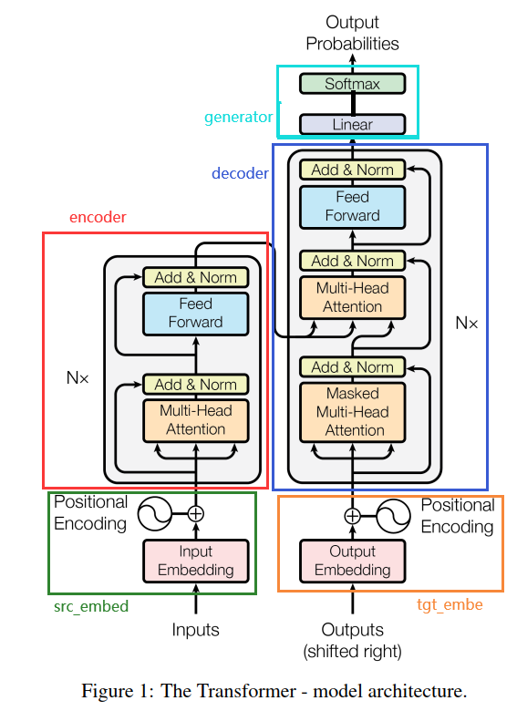
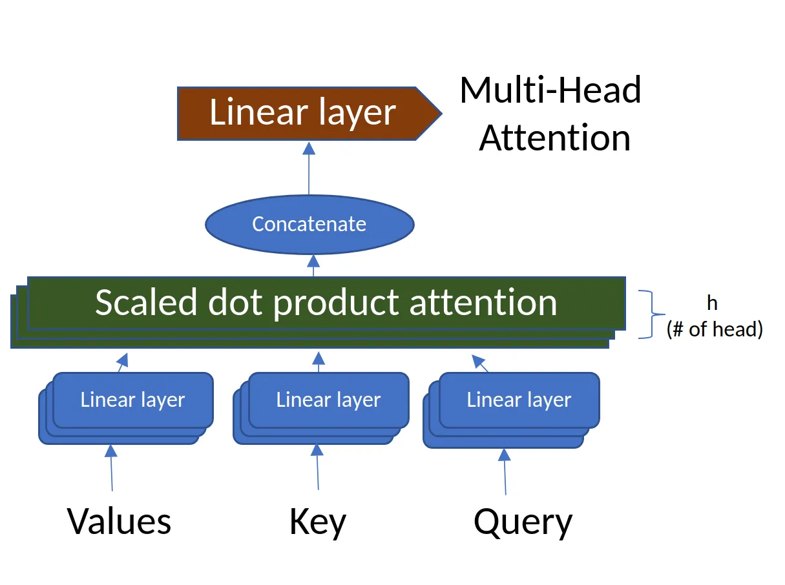

```python
class EncoderDecoder(nn.Module):
    """
    一个标准的EncoderDecoder模型。在本教程中，这么类就是Transformer
    """

    def __init__(self, encoder, decoder, src_embed, tgt_embed, generator):
        """
        encoder: Encoder类对象。Transformer的Encoder
        decoder： Decoder类对象。 Transformer的Decoder
        src_embed: Embeddings类对象。 Transformer的Embedding和Position Encoding
                   负责对输入inputs进行Embedding和位置编码
        tgt_embed: Embeddings类对象。 Transformer的Embedding和Position Encoding
                   负责对“输入output”进行Embedding和位置编码
        generator: Generator类对象，负责对Decoder的输出做最后的预测（Linear+Softmax）
        """
        super(EncoderDecoder, self).__init__()
        self.encoder = encoder
        self.decoder = decoder
        self.src_embed = src_embed
        self.tgt_embed = tgt_embed
        self.generator = generator

    def forward(self, src, tgt, src_mask, tgt_mask):
        """
        src: 未进行word embedding的句子，例如`[[ 0, 5, 4, 6, 1, 2, 2 ]]`
             上例shape为(1, 7)，即batch size为1，句子词数为7。其中0为bos，
             1为eos, 2为pad

        tgt: 未进行word embedding的目标句子，例如`[[ 0, 7, 6, 8, 1, 2, 2 ]]`

        src_mask: Attention层要用的mask，对于source来说，就是要盖住非句子的部分，
                  例如`[[True,True,True,True,True,False,False]]`。相当于对上面
                  `[[ 0, 5, 4, 6, 1, 2, 2 ]]`中最后的`2,2`进行掩盖。

        tgt_mask: Decoder的Mask Attention层要用的。该shape为(N, L, L)，其中N为
                  batch size, L为target的句子长度。例如(1, 7, 7)，对于上面的例子，
                  值为：
                  [True,False,False,False,False,False,False], # 从该行开始，每次多一个True
                  [True,True,False,False,False,False,False],
                  [True,True,True,False,False,False,False],
                  [True,True,True,True,False,False,False],
                  [True,True,True,True,True,False,False], # 由于该句一共5个词，所以从该行开始一直都只是5个True
                  [True,True,True,True,True,False,False],
                  [True,True,True,True,True,False,False],
        """

        # 注意，这里的返回是Decoder的输出，并不是Generator的输出，因为在EncoderDecoder
        # 的forward中并没有使用generator。generator的调用是放在模型外面的。
        # 这么做的原因可能是因为Generator不算是Transformer的一部分，它只能算是后续处理
        # 分开来的话也比较方便做迁移学习。另一方面，推理时只会使用输出的最后一个tensor送给
        # generator，而训练时会将所有输出都送给generator。
        return self.decode(self.encode(src, src_mask), src_mask, tgt, tgt_mask)

    def encode(self, src, src_mask):
        """
        该encode做三件事情：
        1. 对src进行word embedding
        2. 将word embedding与position encoding相加
        3. 通过Transformer的多个encoder层计算结果，输出结果称为memory
        """
        return self.encoder(self.src_embed(src), src_mask)

    def decode(self, memory, src_mask, tgt, tgt_mask):
        """
        memory: Transformer Encoder的输出

        decoder和encoder执行过程基本一样：
        1. 对src进行word embedding
        2. 将word embedding与position encoding相加
        3. 通过Transformer的多个decoder层计算结果

        当完成decoder的计算后，接下来可以使用self.generator（nn.Linear+Softmax）来进行最后的预测。
        """
        return self.decoder(self.tgt_embed(tgt), memory, src_mask, tgt_mask)


```



[Self Attention 解析](https://blog.csdn.net/zhaohongfei_358/article/details/122861751)

nn.Linear **本质就是由一个特征空间线性变换到另一个特征空间。**
目标空间中的任一维——也就是隐层的一个cell——都认为会受到源空间的每一维的影响。不考虑严谨，可以说，目标向量是源向量的加权和。



MultiAttention 代码 单独拎出去
