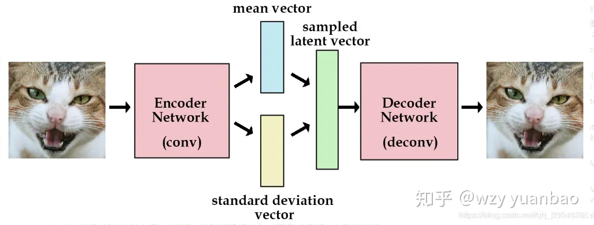

如果要使用VAE，可以参考这个的公式  [VAE 变分自编码 教程](https://ar5iv.labs.arxiv.org/html/1606.05908v1?_immersive_translate_auto_translate=1)

[pytorch代码](https://github.com/ethanluoyc/pytorch-vae)

Conditional Variational Autoencoders

[CVAE Pytorch代码](https://github.com/unnir/cVAE)

### AE（Auto Encoder）

AE（Auto Encoder）分为两个部分：编码器和解码器。编码器可以是任意模型，现在一般都使用卷积神经网络。
输入一张图片经过编码器得到潜变量$Latent Variable$，然后解码器将潜变量$Latent Variable$还原成图片。
然后再通过解码网络进行恢复出原图，所以判断编码和解码网络好坏的
$Loss1=MSE(input, output)$

潜变量，内在特征，在生成之前就决定要生成那张图片。$P=(X|Z)$
所以在AE中可以重构图片。但是没办法生成，因为潜变量是通过Encoder生成的，无法构造一个Latent Variable.

生成如何解决？就有了VAE。

`在编码过程中加一些限制，让其生成的潜变量能够粗略的遵循一个标准正态分布.`

### VAE(Variational AutoEncoder)

先有个前提，我们目的是找到一个隐变量，能根据这个隐变量生成目标。
加入生成X的概率$P(X)$,这个很随机，换算一种方式$P(X)=\sum_Z P(X|Z)P(Z)$,就是我们算出生成Z的概率，以及Z条件下X的概率，就能推出生成X的概率。
这里需要有一个大胆的假设，假设：$P(Z)$服从正态分布，即$P(Z)=N(\mu, \sigma^2)$，那么就可以从正态分布的**噪声**中采样(取一个Z)来生成X。
换个方向,可以修改为：$P(Z)=\sum_XP(Z|X)P(X)$

正态分布，也成为高斯分布。
混合高斯模型就是多个高斯模型的累加。

解释一下这个图片：
想往正态分布$N(\mu, \sigma^2)$上靠，这里就用到交叉熵。

---

因为生成需要特殊的loss函数，包括KL散度。这里再把loss复习一遍。

1. softmax Loss

$Softmax$: 将特征图扁平化后的输出映射到(0,1)之间，给出每个类的概率。
在多分类的时候，全连接后跟一个Softmax， 输出一个分类数量N大小的向量(N,1),**Softmax输出的向量代表每个分类的概率。**

$$
P_j=\frac{e^{a_j}}{\sum_{k=1}^Te^{a_k}}
$$

公式把类别概率归一化到(0,1)之间，**优化目标就是使正确样本的概率最大**

Softmax Loss公式：

$$
L=-\sum_{i=1}^T y_ilogp_j
$$

上式中的$p_j$表示 $S o f t m a x$层输出的第 $j$ 的概率值。$y$ 表示一个 $[1 \times T]$ 的向量，里面的 $T$ 列中只有一个为1，其余为0（真实标签的那个为1，其余不是正确的为0）

2. 交叉熵  Cross Entropy

其中 $p(x)$ 为真实分布，根据真实分布 $p( x )$来衡量识别一个样本的所需要的编码长度的期望（平均编码长度）为：

$$
H(p)= \sum_xp(x)log\frac{1}{p(x)}
$$

​**而交叉熵是使用预测的分布来表示来自真实分布的平均编码长度**​。
也就是评估当前训练得到的​**概率分布与真实分布的差异情况**​，也就是使用错误分布来表示真实分布的平均编码程度。

$$
H(p,q)=-\sum_xp(x)log_2\frac{1}{q(x)}
$$

其中$p(x)$是真实分布的概率，$q(x)$是通过模型计算出来的分分布的概率。
**减少交叉熵就是提升模型的准确率**
预测的分布$q(x)$得到的平均编码程度$H(p,q)$> 真实分布$p(x)$得到的平均编码长度 $H(p)$
定义：$q(x)$得到的平均编码程度$H(p,q)$比$p(x)$得到的平均编码长度 $H(p)$多出来的一部分叫做  **相对熵**

3. 相对熵 (KL散度)

KLD散度(相对熵Relative entropy)： 它表示两个函数或者概率分布的差异性：差异性越大则相对熵越大，反之，差异越小，相对熵越小。这个量来衡量近似分布相比原分布究竟损失了多少信息量，而不是两个分布在空间中的远近距离，所以散度不是距离，

$$
D_{KL}(p,q)=H(p,q)-H(p)= \sum_x p(x)log\frac{p(x)}{q(x)}
$$

$H(p,q) \neq H(q,p)$

**不具有交换性**

所以在VAE中使用KL散度来拟合  $N(\mu, \sigma^2)$ 与 $N(0, 1)$.让他们俩相似，因为KL散度表示的是函数或者概率分布之间的差异，另KL散度越小，两个概率分布就差异越小。

**方差：衡量随机变量或者一组数据的离散程度。方差越大，数据越离散。
标准差：方差的算术平方根，反映组类个体之间的离散程度。**

